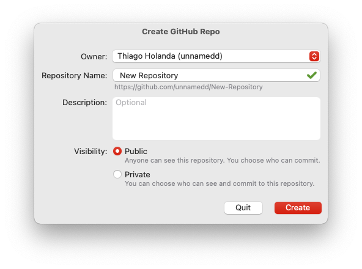
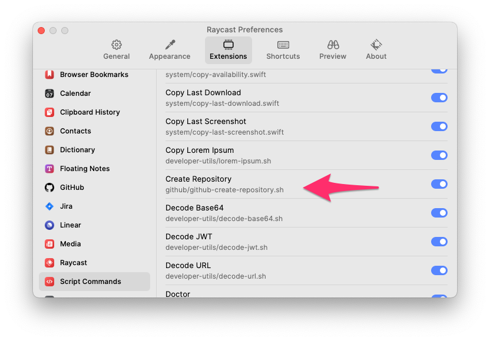
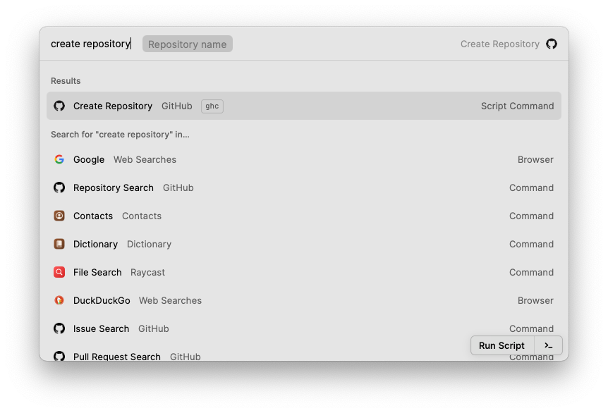

# Create GitHub Repository



[Watch the Script Command in use.](readme-assets/script-command-in-use.mov)

## Motivation

The idea behind of this Script Command is to have a small app to be called via [Raycast](https://raycast.com) to help the users to create fresh repositories in GitHub.

Have any idea? Found a bug? Open an issue. Knows how to and want to contribute? Pull Request are encouraged and welcome! 

## Requirements

- Big Sur
- Swift
- SwiftUI 2.0
- AppKit

[GitHub Access Token](https://github.com/settings/tokens):  
Scopes: [**repo**, **admin:org**, **user**]

## How to install

1. Download this folder to your computer.

2. Create a new [GitHub Access Token](https://github.com/settings/tokens)

3. Edit the file `github-create-repository.sh` and set your token to the variable `access_token` in the beginning of the file.

4. In the Preferences of Raycast, add this uncompressed folder:  
`Raycast > Preferences > Extensions > Script Commands > Add More Directories`



## How to run

1. Open Raycast and type: `create repository`



## Troubleshooting

In case of the script command not appear in the list of Script Commands available, be sure to make the `github-create-repository.sh` executable:

```shell
$ cd <folder of this script command>
$ chmod +x github-create-repository.sh
```

## Credits

[Thiago Holanda](https://twitter.com/tholanda)

## License

Released under an [MIT License](http://opensource.org/licenses/MIT). See `LICENSE` for details.